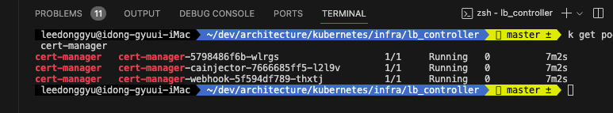

# Kubernetes Use Terraform

```sh
    ## module.network 부터 apply
    cd infra/network terraform apply --auto-approve
    cd infra/clsuter terraform apply --auto-approve

    ## kubeconfig 설정 (하단 Kubectl 클러스터 접근 참조)
    ***

    ## lb_controller
    cd infra/lb-controller kubectl apply -f cert-manager.yaml ## cert-manager object(NS) 생성
    cd infra/lb-controller terraform apply 
    cd infra/lb-controller kubectl apply -f service-account.yaml ## service-account 생성

    ## CERT-Manager.md 참조
    cd infra/lb-controller kubectl apply -f controller.yaml ## LB Controller 생성

    ## kubectl alias
    alias k='kubectl'

    ## kubectl loadbalancer 확인
    k get pods -n kube-system
```

## Kubernetes Test Images

```sh 
  ## images
  docker run -p 3000:3000 -e PORT 3000 zkfmapf123/shoppings:latest
```

## Folder Architecture

```sh
  |- infra                ## terraform 
    |- cluster
    |- lb_controller
  |- kube-objects         ## kubernetes Object
  Makefile 
```

## Kubectl 클러스터 접근

```
  aws --profile admin eks --region ap-northeast-2 update-kubeconfig --name donggyu --alias donggyu

  cat ~/.kube/config
  kubectl config use-context donggyu
```

## Kubernetes 


## Issue

### Kubernetes 구성 시, 이슈
```
 on .terraform/modules/eks/main.tf line 295, in resource "aws_iam_role_policy_attachment" "this":
│  295:   for_each = local.create_iam_role ? toset(compact(distinct(concat([
│  296:     "${local.policy_arn_prefix}/AmazonEKSClusterPolicy",
│  297:     "${local.policy_arn_prefix}/AmazonEKSVPCResourceController",
│  298:   ], var.iam_role_additional_policies)))) : toset([])
│     ├────────────────
│     │ local.create_iam_role is true
│     │ local.policy_arn_prefix is a string, known only after apply
│     │ var.iam_role_additional_policies is empty list of string
```

- eks module을  >= 19.0.0 으로 업그레이드
- 19 버전이후부터는 Cluster SG에 8443 (Karpatener) 가 등록이 이미 되어있음 (Already Exists)
```tf
node_security_group_additional_rules = {
    ingress_nodes_karpenter_port = {
      description                   = "Cluster API to Node group for Karpenter webhook"
      protocol                      = "tcp"
      from_port                     = 8443
      to_port                       = 8443
      type                          = "ingress"
      source_cluster_security_group = true
    }
  }
```
- eks-node-group을 따로 구성 (eks-node-group.tf)

### lb contorller 설정 시, webhook 이슈

```sh
Error from server (InternalError): error when creating "controller.yaml": Internal error occurred: failed calling webhook "webhook.cert-manager.io": failed to call webhook: Post "https://cert-manager-webhook.cert-manager.svc:443/validate?timeout=30s": no endpoints available for service "cert-manager-webhook"
Error from server (InternalError): error when creating "controller.yaml": Internal error occurred: failed calling webhook "webhook.cert-manager.io": failed to call webhook: Post "https://cert-manager-webhook.cert-manager.svc:443/validate?timeout=30s": no endpoints available for service "cert-manager-webhook"
```

- cert-manager의 endpoint 설정이 되어있는지 확인해봐야 함
- <b> 노도 인스턴스가 최소 3개여야 함 </b>

```sh

## cert-manager가 잘 떠있는지 확인
kubectl get pods -A | grep cert-manager


