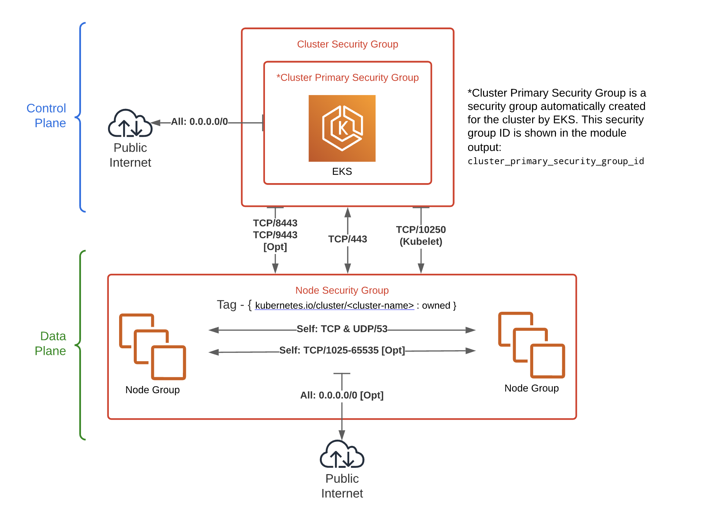

# Kubernetes Use Terraform

```sh
    ## module.network 부터 apply
    terraform apply -target module.network
```

## Kubectl 클러스터 접근

```
  aws --profile kube-admin eks --region ap-northeast-2 update-kubeconfig --name donggyu --alias donggyu

  cat ~/.kube/config
  kubectl config use-context donggyu
```

## Kubernetes 



## Issue

### Kubernetes 구성 시, 이슈
```
 on .terraform/modules/eks/main.tf line 295, in resource "aws_iam_role_policy_attachment" "this":
│  295:   for_each = local.create_iam_role ? toset(compact(distinct(concat([
│  296:     "${local.policy_arn_prefix}/AmazonEKSClusterPolicy",
│  297:     "${local.policy_arn_prefix}/AmazonEKSVPCResourceController",
│  298:   ], var.iam_role_additional_policies)))) : toset([])
│     ├────────────────
│     │ local.create_iam_role is true
│     │ local.policy_arn_prefix is a string, known only after apply
│     │ var.iam_role_additional_policies is empty list of string
```

- eks module을  >= 19.0.0 으로 업그레이드
- 19 버전이후부터는 Cluster SG에 8443 (Karpatener) 가 등록이 이미 되어있음 (Already Exists)
```tf
node_security_group_additional_rules = {
    ingress_nodes_karpenter_port = {
      description                   = "Cluster API to Node group for Karpenter webhook"
      protocol                      = "tcp"
      from_port                     = 8443
      to_port                       = 8443
      type                          = "ingress"
      source_cluster_security_group = true
    }
  }
```
- eks-node-group을 따로 구성 (eks-node-group.tf)