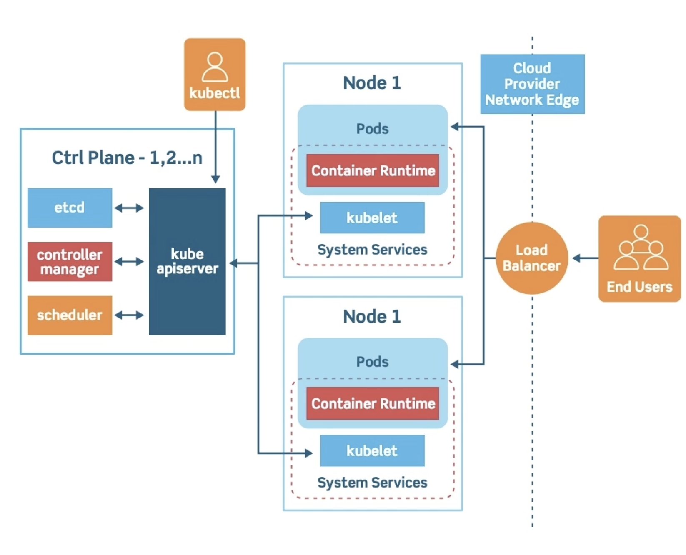
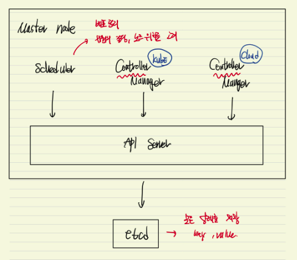
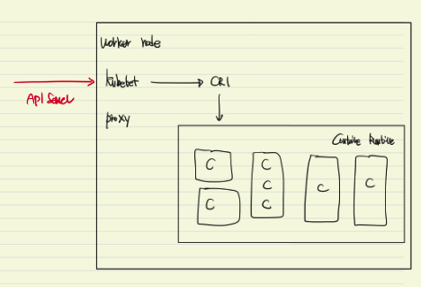

# Container-Orchestration System

## 여러 머신으로 구성된 클러스터상에서 컨테이너를 효율적으로 관리하기 위한 시스템 (example. 운영체제)

- 여러대의 머신 (Cluster) 에서 서비스들을 관리
- Scaling, Rollback / Rollout
- Resource Allocation (CPU, Memory)
- Service Discovery (ETCD)
- Self Healing
- Storage Orchestration (외부 저장소 Orchestration)

## Kubernetes 구성



### Control Plain (Master Node)



- 홀수 개
- kubectl을 사용하여 communication 진행
- 클러스터를 <b>상태를 담당 / 관리</b>하는 역할
- 상태관리 및 명령어 처리

### Control Plain > 제어영역

> API Server

- Client의 요청을 처리 (API)
- 주로 Client와 Master Node에 Proxy를 담당

> Scheduler

- 배포 관리를 진행
- 배포될 자원의 할당 이나 노드위치를 관리

> Controller Manager

- 여러 Controller Process를 관리

> etcd

- 분산 Key-Value 저장소로 클러스터의 상태를 저장
- API Server

### Node (Worker Node)



- Application Container 실행

> Kubelet

- 컨테이너 런타임과 통신하며, Lifecycle을 관리
- API 서버와 통신하며 노드의 리소르를 관리

> CRI (Container Runtime Interface)

- Kubelet과 Container Runtime과 통신할때 사용되는 Interface
- Docker, container-d, cri-o의 runtime 지원

> Kube-Proxy

- 네트워크를 구성
- proxy, 내부 load-balancer 역할을 수행

### Kubernetes Api-Resources 운영

[Pod](./pod.md)
[Service](./service.md)

### 유용한 명령어

```sh
    ## kubectl 명령어 모음
    kubectl

    ## api-resources
    ## api 확인
    kubectl api-resourecs | grep ''
```
