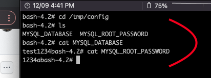

# ConfigMap

## 간단한 MYSQL 을 띄워서 환경변수 넣는 yaml

```sh
    sh scp.sh

    ## In Linux
    alias kc='kubectl'
    cd /yamls/configmap

    ## 그냥 간단한 mysql
    kc apply -f mysql.yaml
```

## 환경변수 자체를 configmap으로 대체한경우

```sh

    kc apply -f configmap.yaml
    kc describe cm [config-map-pod-name]

    kc apply -f mysql-config.yaml

    ## mysql-config.yaml 에 있는 환경변수를 envFrom으로 대체한다
```

## 환경변수에서 필요한 부분만 대체하고싶을 경우

```sh

    kc apply -f configmap.yaml

    ## password만 사용
    kc apply -f mysql-config-from.yaml
```

## Volume을 사용해서 대체할경우



```sh

    kc apply -f mysql-config-volume.yaml
    kc exec -it [pod-name] -- /bin/bash

    cd /tmp/config
```

## ConfigMap 생성명령어

```sh
    ## configmap 생성 (empty)
    kc create configmap my-config

    kc create configmap my-config --from-file config.yaml

    kc create configmap my-config --from-file config=config.yaml

    ##  ***클러스터에 반영은 하지 말되, --dry-run -o yaml 옵션을 사용해서 실제 yaml 파일을 출력해서 볼수있음
    kc create configmap my-config --from-file config=config.yaml --dry-run -o yaml
```
