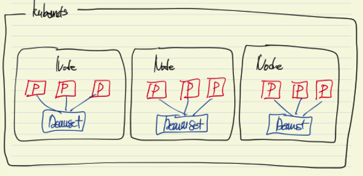

# DaemonSet

- 각 노드마다 꼭 실행되어야 하는 워크로드(로그수집, 메트릭수집, 네트워크 구성)이 있다면?
- 클러스텅 상에 모든 노드에 동일한 파드를 하나씩 생성
- 주로 로그수집 : (fileabeat, fluentbit)
- 메트릭수집 : node-exporter (prometheus), metricbeat (elk)
- 네트워크 구성 : kube-proxy, calico

## Command
