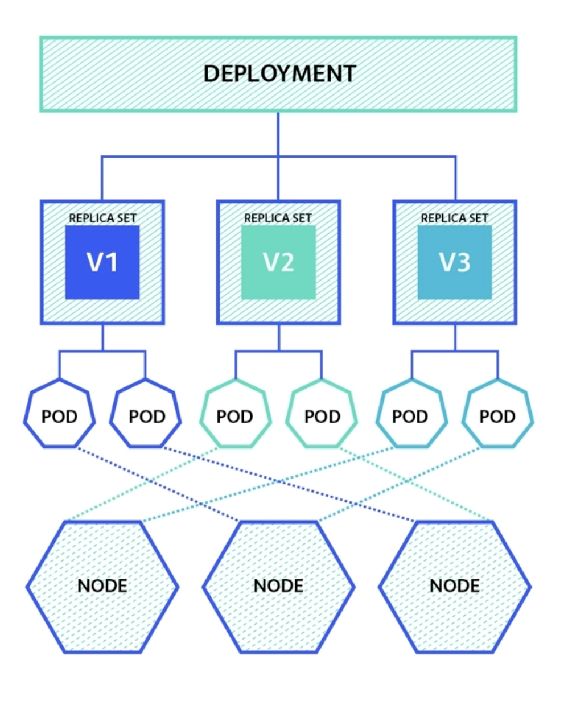

# Pod 운영



## Replicaset

```sh
kc get pods
kc get rs
```

- Pod의 수를 동적으로 늘리고 싶다면? Replicaset
- 정해진 수의 파드가 항상 실행될수 있도록 관리
- 기존 실행중이던 파드에 문제가 생기면 파드를 다시 스케쥴링

## Deployment

```sh
    sh scp.sh
    kubectl apply -f deployment.yaml
```

- Deployment (Replicaset + Pod)
- pod의 이미지 버전이 갱신될때 <b>배포전략을 설정</b>
- Deployment Object를 생성하면 대응되는 Replicaset과 Pod가 자동으로 생성
- <b>기본적으로 Recreate 전략과 RollingUpdate 전략을 지원</b>
- 사용하는 형태
  - 기존 v1의 Pod를 v2로 배포를 진행할때
  - 새로운 v2의 버그가 발생하여, v1으로 Rollback을 진행할 때

### Deployment의 배포전략

> 재생성

- 기존 Replicaset 파드를 모두 종류 후 -> 새로 생성
- Production Level에서는 Service의 Downtime이 존재함

> 롤링 업데이트

- 기존 Replicaset + 새로운 Replicaset 모두 띄워서 교체하는 방법
- 세부 설정이 가능
  - maxSurge : spec.replicas 수 기준 최대 새로 추가되는 파드 수
  - maxUnavailable : spec.replicas 수 기준 최대 이용 불가능 파드 수

```sh
    ## 기존 pod의 값은 10개

    ## 기존 pod 10개는 Ready 상태로 유지하되, 11개까지 새롭게 만들어진다. => 안정적이나 클러스터의 노드가 부족해질 수 있다.
    ## 기존 10개를 유지하면서 -> 1개씩 업데이트 된다는 얘기 (10%)
    maxSurge : 1
    maxUnavaiable : 0

    ## 전체갯수는 항상 10개를 유지 => 노드자원이 초과될 여지가 없다
    ## 기존에 1개를 삭제 (9개) -> 새로운것을 새로 배포(10개)
    maxSurge : 0
    maxUnavailable : 1
```

> 배포 스크립트

```sh
    alias kc='kubectl'

    ## 1. Record 명령어를 통해서 배포진행
    kc apply -f rolling.yaml --record

    ## 2. 배포 진행
    kc set image deployment rolling nginx=nginxdemos/hello:latest --record

    ## 3. history 확인
    kc rollout history deployment [pod 이름]

    kc rollout status deployment [pod 이름]
```
