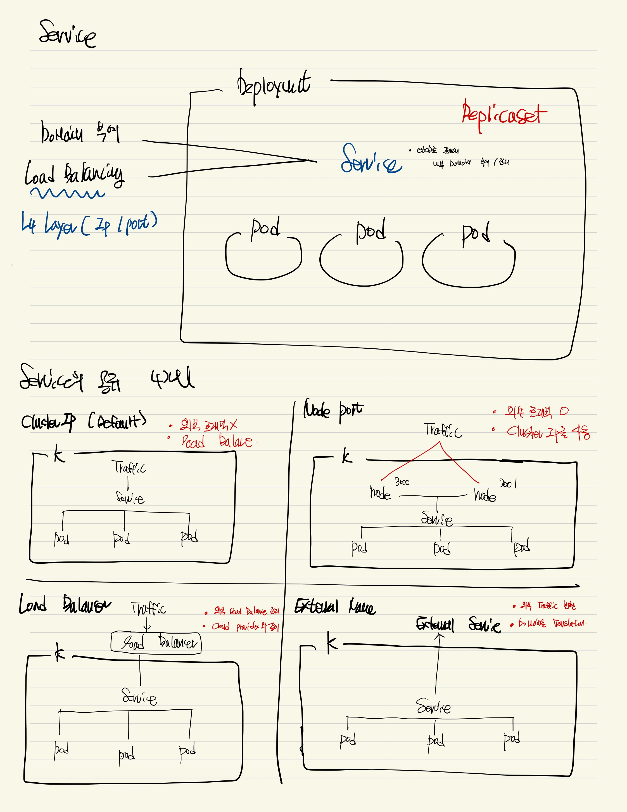

# Service

- Kubernetes API Resource
- 외부의 요청을 받기위해서 필요한 API Resource + 트래픽 분산
- 기존 Deployment를 사용하여 Scale out을 진행하지만, 그의 대한 고유 도메인과, Load Balancing (L4 layer) 은 Service로 진행
- 또한 고유 도메인 부여



> ClusterIP

- 기본값 (Default)
- 외부 트래픽을 전달받지 않음
- 내부 트래픽의 대한 Load Balaning을 진행
- 내부 트래픽이라서 Pod들의 로드밸런싱이 이뤄짐

> Node Port

- 외부 트래픽을 받을 수 있음
- Cluster Ip를 사용하면서 짆애

> Load Balancer

- 외부 트래픽을 받을 수 있음
- Cloud Provider를 사용하여 외부의 Load Balancer를 Handling

> External Name

- 기존 트래픽의 대한 Load Balancing 기능은 아님
- 기존 Domain자체를 Translation을 진행

```sh
    sh scp.sh

    ## In Linux
    alias kc='kubectl'

    ## Common
    cd services
    kc apply -f deployment.yaml

    ######## Clusterip
    cd services/clusterip
    kc apply -f service.yaml

    ## ClusterIP의 Cidr Range
    kc cluster-info dump | grep -m 1 service-cluster-ip-range

    ######## Node Port
    cd service/node-port
    kc apply -f service.yaml

```
